 
## 查看主页获取源码

### 一、作品包含

源码+数据库+设计文档万字+PPT+全套环境和工具资源+部署教程

### 二、项目技术

前端技术：Html、Css、Js、Vue、Element-ui

数据库：MySQL

后端技术：Java、Spring Boot、MyBatis

  

### 三、运行环境

开发工具：IDEA/eclipse

数据库：MySQL5.7

数据库管理工具：Navicat10以上版本

环境配置软件： JDK1.8+Maven3.6.3

前端Nodejs：14

### 四、项目介绍
项目编号：springbootA168

高校门诊管理系统的背景在于解决高校医疗机构在提供医疗服务时面临的效率低下、信息不对称、资源分配不合理等问题。随着高校规模的扩大和学生的健康意识增强，高校医疗机构的服务需求不断增长，而传统的手工管理方式已无法满足高效、精确的医疗服务需求。因此，开发一套集成化、智能化的门诊管理系统，对于优化医疗服务流程、提高医疗服务质量。该系统能全流程的数字化管理，从而提升整体医疗服务水平和效率。

系统分为管理员、用户、医生
管理员的功能：系统首页、个人中心、用户管理、用户充值管理、医生管理、挂号信息管理、检查开药管理、药品信息管理、药品入库管理和取药出库管理。
用户的功能：系统首页、个人中心、用户充值管理、医生管理、挂号信息管理、检查开药管理、药品信息管理、取药出库管理。
医生的功能：系统首页、个人中心、挂号信息管理、检查开药管理、药品信息管理、药品入库管理、取药出库管理。

### 五、运行截图

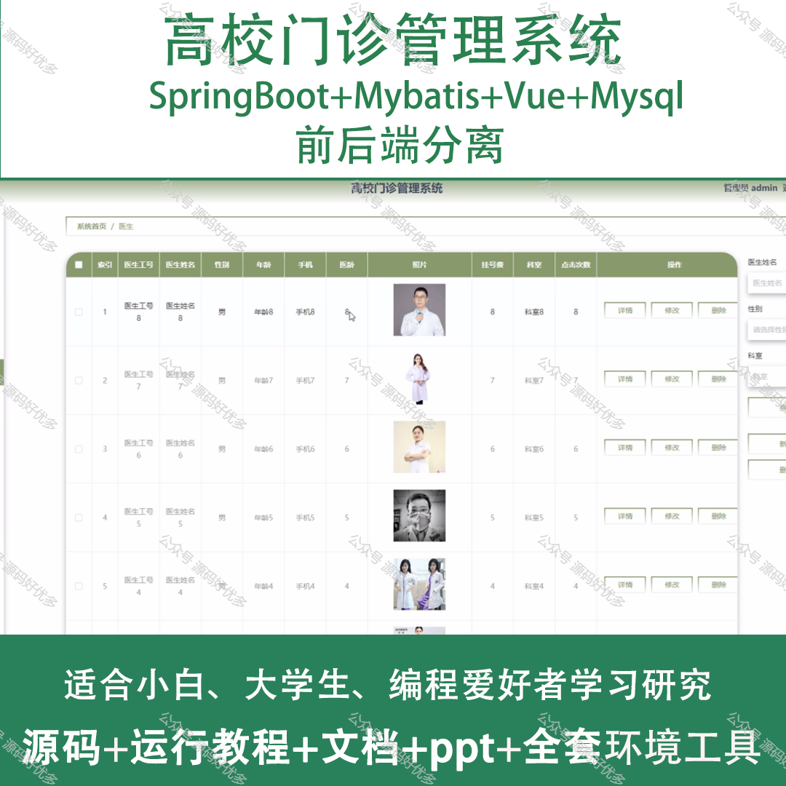
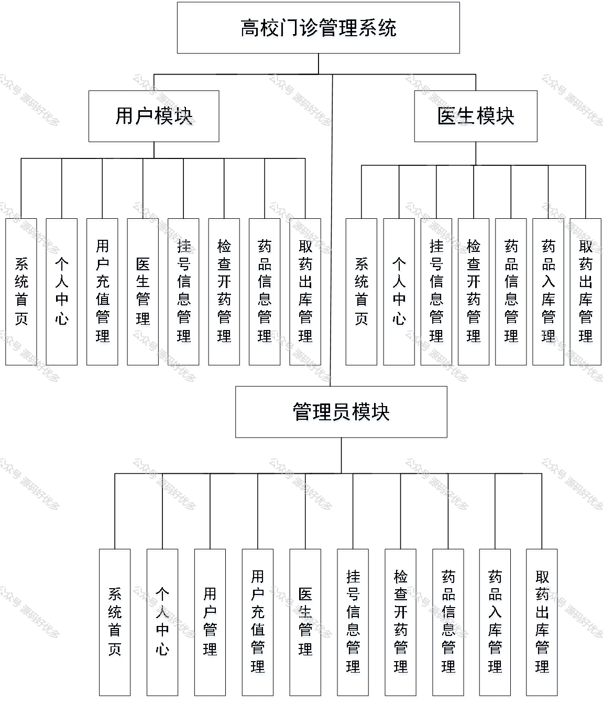
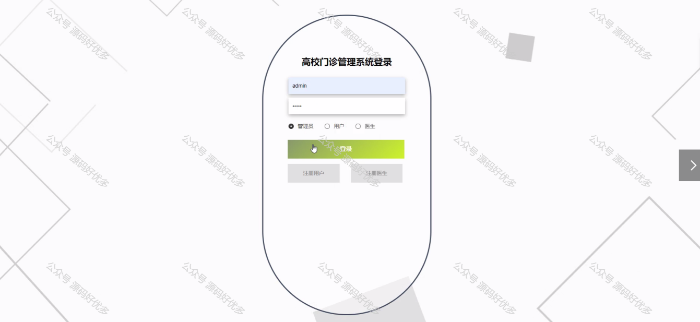
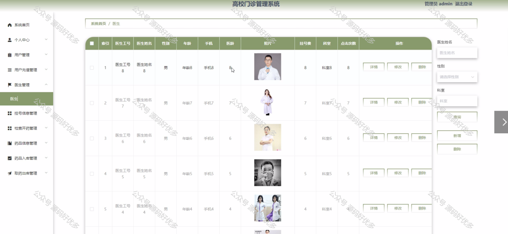
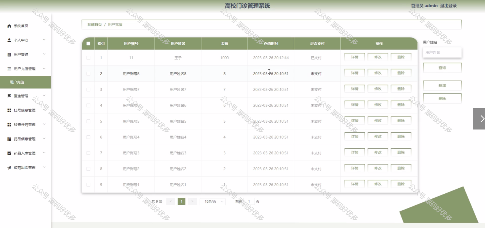
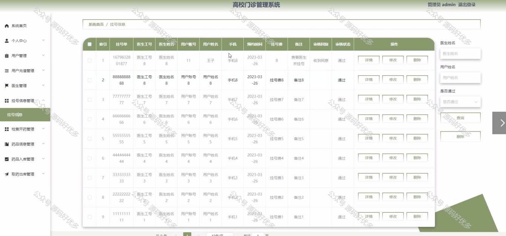
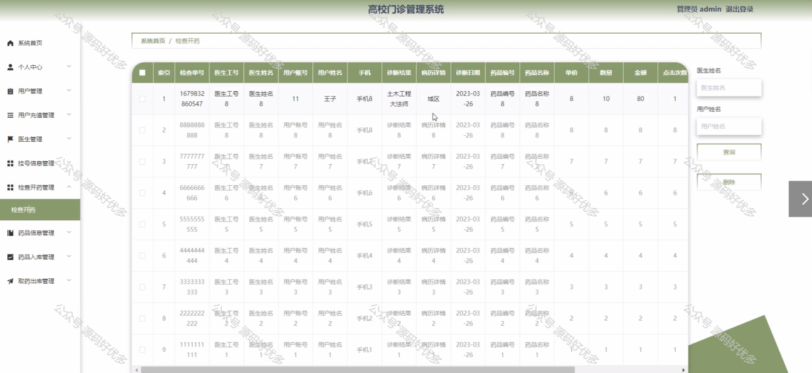
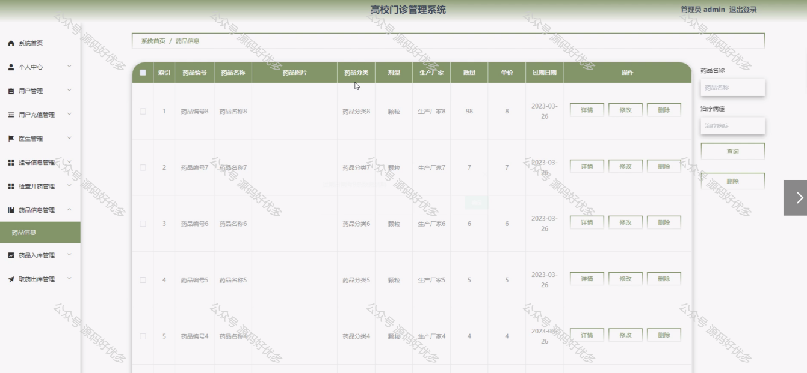
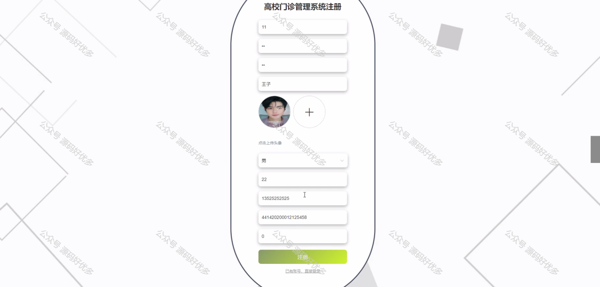
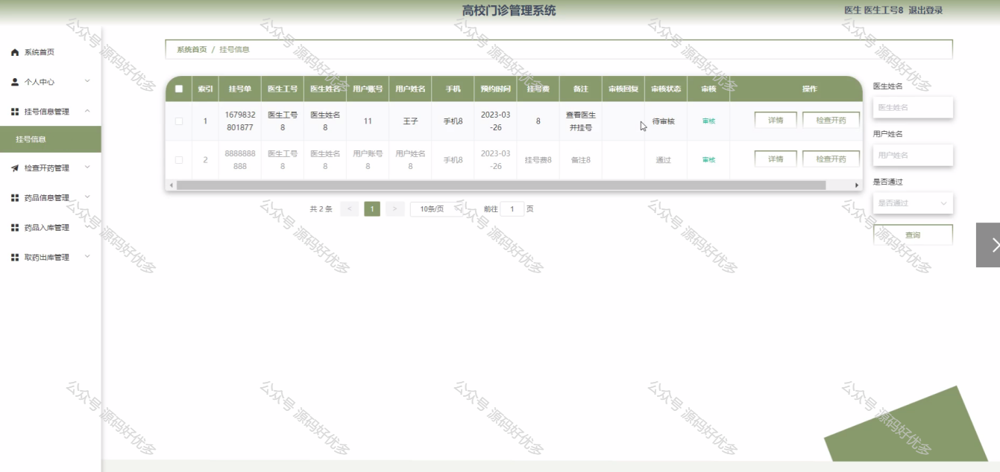
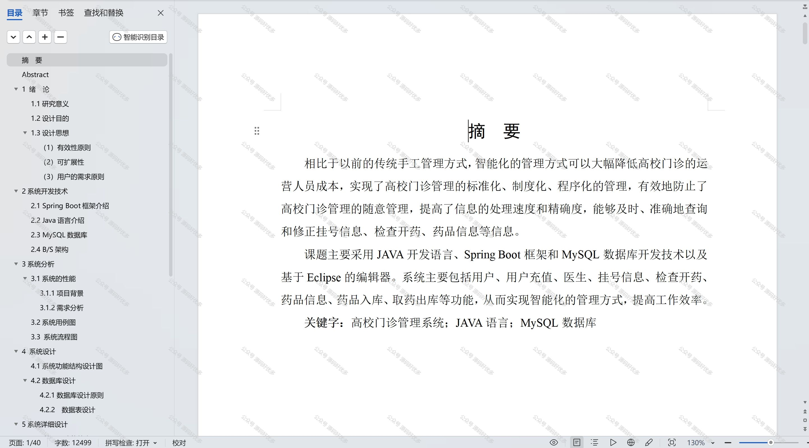

  

